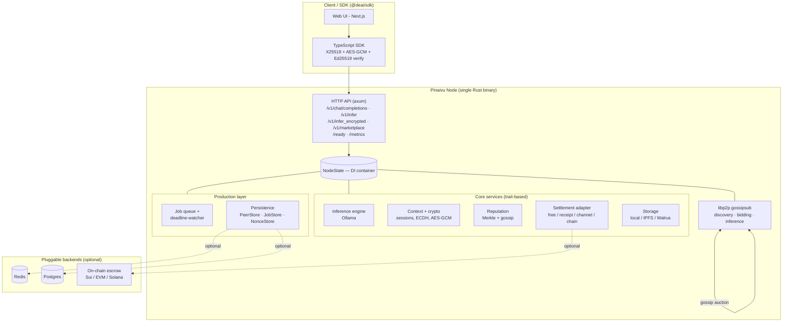

# Pinaivu — Decentralised AI Inference

Pinaivu is a peer-to-peer network where GPU nodes compete to serve AI inference requests. It works without a blockchain — the P2P layer is the source of decentralisation. Payments are an optional plug-in.

```
standalone     → single machine, no P2P, no payment. Dev/personal use.
network        → full P2P between nodes, no payment. Private cluster.
network_paid   → P2P + optional on-chain escrow. Public trustless marketplace.
```

## Quick start

### Prerequisites

- Rust 1.78+ (`rustup update stable`)
- [Ollama](https://ollama.ai) with at least one model pulled (e.g. `ollama pull llama3.1:8b`)

### Build

```bash
git clone https://github.com/KaushikKC/Pinaivu.git
cd Pinaivu
cargo build --release
```

Binary lands at `target/release/pinaivu`.

### Run a standalone node

```bash
./target/release/pinaivu start --mode standalone
```

The node listens on `http://localhost:4002` and is fully OpenAI-compatible:

```bash
curl http://localhost:4002/v1/chat/completions \
  -H "Content-Type: application/json" \
  -d '{"model":"llama3.1:8b","messages":[{"role":"user","content":"Hello"}],"stream":false}'
```

### Run in network mode (P2P)

```bash
./target/release/pinaivu start --mode network
```

The node joins the gossip network, announces its capabilities, and starts accepting inference bids from other peers.

## Configuration

Copy `docs/config.example.toml` to `~/.pinaivu/config.toml` and edit as needed. All fields have sane defaults.

Key settings:

| Setting | Default | Description |
|---------|---------|-------------|
| `inference.engine` | `ollama` | Inference backend |
| `inference.default_model` | `llama3.1:8b` | Model used when client doesn't specify |
| `network.listen_port` | `7771` | P2P libp2p port |
| `network.bootstrap_nodes` | public seed | Nodes to connect to on startup |
| `health.api_port` | `4002` | OpenAI-compatible inference API |
| `health.metrics_port` | `7770` | Health + Prometheus metrics |
| `persistence.peer_store` | `memory` | Peer registry backend (`memory` \| `redis`) |
| `persistence.job_store` | `memory` | Job-queue backend (`memory` \| `postgres`) |

## API

The node exposes an HTTP API that is a superset of the OpenAI API.

| Endpoint | Description |
|----------|-------------|
| `POST /v1/chat/completions` | OpenAI-compatible chat (streaming + non-streaming) |
| `GET /v1/models` | OpenAI-compatible model list |
| `POST /v1/infer` | Native inference with Ed25519-signed proof receipt |
| `POST /v1/infer_encrypted` | End-to-end encrypted inference (X25519 ECDH + AES-256-GCM) |
| `GET /v1/pubkey` | Node's Ed25519 and X25519 public keys |
| `GET /v1/peers` | All known P2P peers with capabilities |
| `POST /v1/marketplace/request` | Broadcast a bid request, collect responses |
| `GET /health` | Liveness — the process is up |
| `GET /ready` | Readiness — `200` when the inference engine is reachable, `503` otherwise |

A separate operations server (default port `7770`) exposes `GET /health` and `/livez` (liveness), `GET /metrics` (Prometheus text format), and `GET /peers` (connected peer count).

## TypeScript SDK

```bash
cd sdk && npm install
```

```typescript
import { DeAIClient } from '@deai/sdk';

const client = new DeAIClient({ nodeUrl: 'http://localhost:4002' });

// Plaintext inference
for await (const chunk of client.infer({ model: 'llama3.1:8b', prompt: 'Hello' })) {
  process.stdout.write(chunk.token);
}

// End-to-end encrypted
const session = await client.createEncryptedSession();
for await (const chunk of client.inferEncrypted(session, { prompt: 'Hello' })) {
  process.stdout.write(chunk.token);
}
```

## Settlement / Payments

Settlement adapters are optional. The node always falls back to free (no-payment) mode.

| Adapter | Status | Notes |
|---------|--------|-------|
| `free` | Built-in | Always available, no chain |
| `receipt` | Built-in | Off-chain signed receipt |
| `channel` | Built-in | In-memory payment channel (on-chain via EVM config) |
| `evm-<chainId>` | Built-in | EVM chains (Base, Arbitrum, Ethereum, …) |
| `sui` | Built-in | Sui Move contracts |
| `solana` | Feature flag | `cargo build --features solana` |

Smart contracts (Solidity / Move / Anchor) are not deployed yet — see `contracts/README.md` for the interface spec.

## Architecture

Pinaivu is a **single Rust binary** whose every subsystem is a swappable trait,
assembled at startup into one shared dependency-injection container
(`NodeState`). Decentralisation comes from the peer-to-peer layer — not a
blockchain — and the node provides three chain-free guarantees: **verifiable
inference** (Ed25519 proof-of-inference over the content hashes of input and
output), **prompt privacy** (per-request X25519 ECDH + AES-256-GCM, decrypted
only in-process), and **Sybil-resistant reputation** (Merkle-committed scores
gossiped as signed roots).



**Trait seams** — the core never knows which concrete backend it is talking to:

| Subsystem | Implementations |
|-----------|-----------------|
| Inference | Ollama (engine trait) |
| Storage | local filesystem · IPFS · Walrus |
| Settlement | free · receipt · payment-channel · EVM · Sui · Solana |
| Reputation | local (file) · gossip (Merkle roots over P2P) |
| Persistence | in-memory · Redis (peer/nonce) · Postgres (jobs) |

**Production layer.** State is concentrated in the `NodeState` container and the
registries sit behind persistence traits, so the same binary runs as one
in-memory node *or* as several stateless replicas sharing one Redis/Postgres.
A deadline-watcher tracks every dispatched inference and runs a chain-free
compensating action on jobs that miss their deadline; the HTTP servers drain via
a single graceful-shutdown signal; `/ready` vs `/health` separate readiness from
liveness; `/metrics` exposes Prometheus counters.

See [`docs/architecture.md`](docs/architecture.md) for the full data flow and
[`docs/paper.md`](docs/paper.md) for the technical/research write-up.

## Repository layout

```
crates/
  common/         # shared types, config, errors
  node/           # HTTP API (api/), daemon, NodeState, job queue, identity
  p2p/            # libp2p gossipsub network
  inference/      # Ollama backend, bid selection
  settlement/     # payment adapter traits + implementations
  reputation/     # Merkle-tree reputation store
  storage/        # local / IPFS / Walrus storage backends
  context/        # session context management, encryption
  persistence/    # PeerStore / JobStore / NonceStore (in-mem · Redis · Postgres)
  blockchain-iface/ # blockchain trait interface
sdk/              # TypeScript SDK (@deai/sdk)
web/              # Next.js web UI
landing-page/     # Marketing site (Next.js)
programs/pinaivu/ # Anchor/Solana program (build separately)
contracts/        # EVM + Move contract interfaces
docs/             # Architecture docs, config example
deploy/           # systemd service file, install script
```

## Running tests

```bash
cargo test
```

## Contributing

Pull requests are welcome. For larger changes, open an issue first to discuss the approach.

## License

MIT — see [LICENSE](LICENSE).
